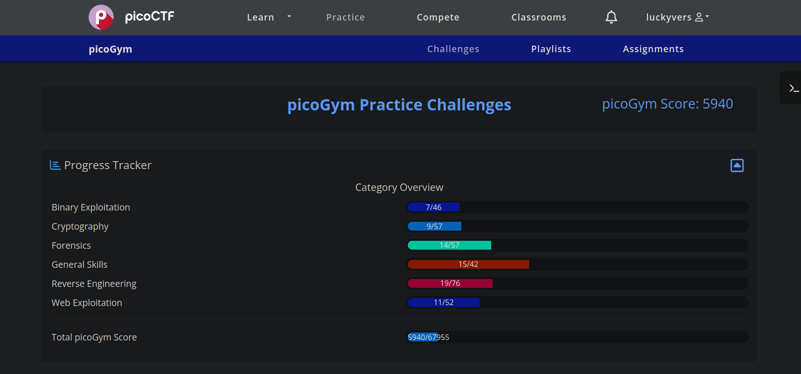

# PicoCTF

Challenges for the second part of **Cryptonite's** Junior Taskphase (JTP).

**Completion Table**

| **Domain**          | **Count** | **Completed** | **Pending** |
| ------------------- | :-------: | :-----------: | :---------: |
| Web Exploitation    |   3       |   3           |    0        |
| Reverse Engineering |   3       |   3           |    0        |
| Forensics           |   3       |   3           |    0        |
| Binary Exploitation |   3       |   3           |    0        |
| Cryptography        |   3       |   3           |    0        |
| 2 of any 2 domains  |   4       |   4           |    0        |
| Total               |   19      |   19          |    0        |

The final dashboard after completing all the challenges looks like this:

