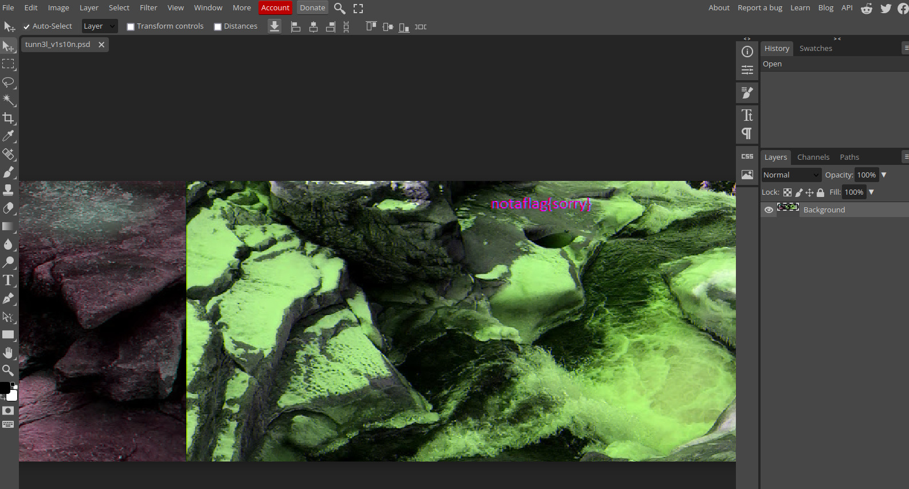
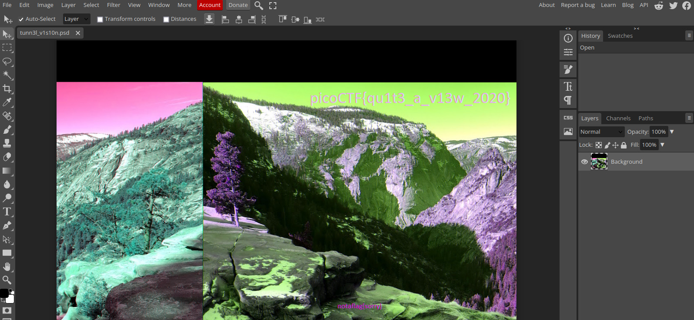
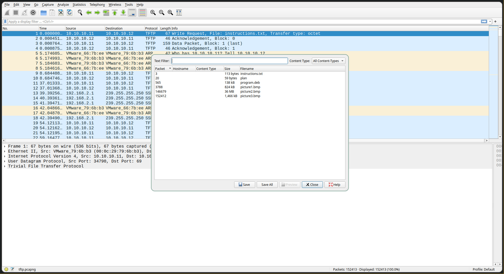
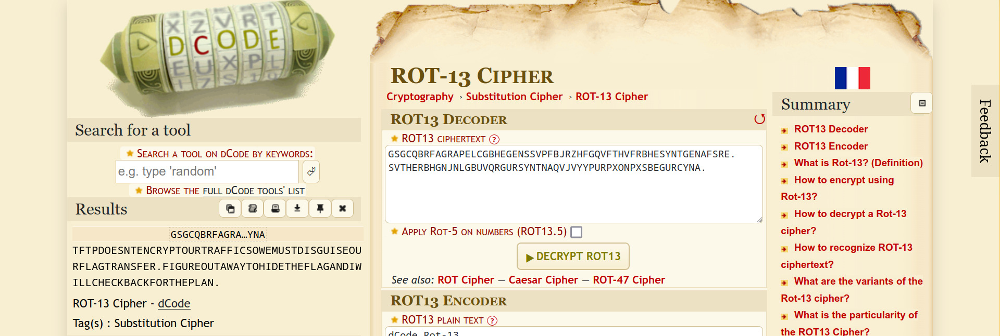
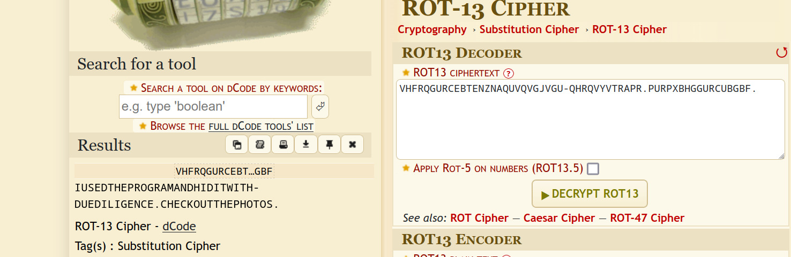

# tunn3l v1s10n

**Flag:** `picoCTF{qu1t3_a_v13w_2020}`

We're given a file `tunn3l_v1s10n`. Running `exiftool` on it gives us the following information about it

```
~/Downloads $ exiftool tunn3l_v1s10n
ExifTool Version Number         : 12.60
File Name                       : tunn3l_v1s10n
Directory                       : .
File Size                       : 2.9 MB
File Modification Date/Time     : 2023:11:05 20:32:44+05:30
File Access Date/Time           : 2023:11:05 20:32:44+05:30
File Inode Change Date/Time     : 2023:11:05 20:36:04+05:30
File Permissions                : -rw-r--r--
File Type                       : BMP
File Type Extension             : bmp
MIME Type                       : image/bmp
BMP Version                     : Unknown (53434)
Image Width                     : 1134
Image Height                    : 1134
Planes                          : 1
Bit Depth                       : 24
Compression                     : None
Image Length                    : 2893400
Pixels Per Meter X              : 5669
Pixels Per Meter Y              : 5669
Num Colors                      : Use BitDepth
Num Important Colors            : All
Red Mask                        : 0x27171a23
Green Mask                      : 0x20291b1e
Blue Mask                       : 0x1e212a1d
Alpha Mask                      : 0x311a1d26
Color Space                     : Unknown (,5%()
Rendering Intent                : Unknown (826103054)
Image Size                      : 1134x1134
Megapixels                      : 1.3
```

It seems to be a bitmap file with a size of 1134x1134 pixels. To indicate this, we rename it to `tunn3l_v1s10n.bmp`.

Now opening the file in Photopea, we get this result



The file seems to be missing pixels in its height, since it was given its height and width were the same (1134).

So, we need to change the headers of the bitmap to change it to its correct resolution. For this, we open a hex editor such as `xxd` to edit it

The height of a bitmap file is given at offset 0x16.

```
~/Downloads $ xxd tunn3l_v1s10n.bmp | head -2
00000000: 424d 8e26 2c00 0000 0000 bad0 0000 bad0  BM.&,...........
00000010: 0000 6e04 0000 3201 0000 0100 1800 0000  ..n...2.........
                         ^^^^
                      the height
```

`3201` in this means a height of `0x0132` (306 in decimal). This is because the bitmap is a little-endian file format, with the least significant byte (LSB) stored first. So we change it to 1134 in hexdecimal, which is `0x46e`, or `6e04` in little-endian form.

```
~/Downloads $ xxd tunn3l_v1s10n.bmp | head -2
00000000: 424d 8e26 2c00 0000 0000 bad0 0000 bad0  BM.&,...........
00000010: 0000 6e04 0000 6e04 0000 0100 1800 0000  ..n...n.........
                         ^^^^
                      the height
```

Now opening this in Photopea, we get this result, and the flag comes out to be `picoCTF{qu1t3_a_v13w_2020}`.



# Trivial Flag Transfer Protocol

**Flag:** `picoCTF{h1dd3n_1n_pLa1n_51GHT_18375919}`

We get a file `tftp.pcapng`. Opening it in `wireshark`, we extract all the files transferred using the `TFTP` protocol.



In the file `instructions.txt`, the message is `GSGCQBRFAGRAPELCGBHEGENSSVPFBJRZHFGQVFTHVFRBHESYNTGENAFSRE.SVTHERBHGNJNLGBUVQRGURSYNTNAQVJVYYPURPXONPXSBEGURCYNA.`, and seems to be a ROT-13 cipher. And indeed, decoding it we get



Removing the spaces, the instructions seem to be

*"TFTP doesn't encrypt our traffic so we must disguise our flag transfer. Figure out a way to hide the flag and I will check back for the plan."*

In the file `plan`, we follow the same process



Using the same method we did earlier with `ROT-13`, we get the final message as

*"I used the program and hid it with - due diligence. Check out the photos."*

We also have three images and a `.deb` file

```
~/Downloads $ ls -1
instructions.txt
picture1.bmp
picture2.bmp
picture3.bmp
plan
program.deb
tftp.pcapng
```

Extracting the `.deb` package, we're greeted to three new files

```
~/Downloads/program $ ar x program.deb
~/Downloads/program $ ls -1
control.tar.gz
data.tar.xz
debian-binary
program.deb
```

Analyzing `data.tar.xz`, we discover that the program being used was `steghide`

```
~/Downloads $ atool -l data.tar.xz
drwxr-xr-x root/root         0 2014-10-15 05:32 ./
drwxr-xr-x root/root         0 2014-10-15 05:32 ./usr/
drwxr-xr-x root/root         0 2014-10-15 05:32 ./usr/share/
drwxr-xr-x root/root         0 2014-10-15 05:32 ./usr/share/doc/
drwxr-xr-x root/root         0 2014-10-15 05:32 ./usr/share/doc/steghide/
-rw-r--r-- root/root      6066 2014-10-15 05:32 ./usr/share/doc/steghide/ABOUT-NLS.gz
-rw-r--r-- root/root      2771 2014-10-15 05:32 ./usr/share/doc/steghide/LEAME.gz
-rw-r--r-- root/root      2488 2003-09-28 21:00 ./usr/share/doc/steghide/README.gz
-rw-r--r-- root/root      1763 2014-10-15 05:31 ./usr/share/doc/steghide/changelog.Debian.gz
-rw-r--r-- root/root       215 2014-10-15 05:31 ./usr/share/doc/steghide/changelog.Debian.amd64.gz
```

`steghide` requires a passphrase to extract data from images. Remember the sentence

> IUSEDTHEPROGRAMANDHIDITWITH-DUEDILIGENCE.CHECKOUTTHEPHOTOS.

This seems to hint at the passphrase being `DUEDILIGENCE`. Trying it on the three images, we get the following results

```
~/Downloads $ for pic in *.bmp; do steghide --extract -sf "$pic" -p "DUEDILIGENCE"; done
steghide: could not extract any data with that passphrase!
steghide: could not extract any data with that passphrase!
wrote extracted data to "flag.txt".
```

And the contents of `flag.txt` are the flag in plaintext.

```
~/Downloads $ cat flag.txt
picoCTF{h1dd3n_1n_pLa1n_51GHT_18375919}
```

# MacroHard WeakEdge

**Flag:** `picoCTF{D1d_u_kn0w_ppts_r_z1p5}`

We're given a file `Forensics is fun.pptm`. Since PPT files are essentially zip files, we change its extension to `.zip` and extract it.

```
~/Downloads $ mv Forensics\ is\ fun.pptm Forensics\ is\ fun.zip
renamed 'Forensics is fun.pptm' -> 'Forensics is fun.zip'
~/Downloads $ atool -x Forensics\ is\ fun.zip
Archive:  Forensics is fun.zip
  inflating: Unpack-3555/[Content_Types].xml
  inflating: Unpack-3555/_rels/.rels
  inflating: Unpack-3555/ppt/presentation.xml
  inflating: Unpack-3555/ppt/slides/_rels/slide46.xml.rels
  inflating: Unpack-3555/ppt/slides/slide1.xml
  inflating: Unpack-3555/ppt/slides/slide2.xml
  inflating: Unpack-3555/ppt/slides/slide3.xml
.
.
.
```

Entering the directory `Forensics is fun`, we find a file called `hidden` inside the `ppt/slideMasters` subdirectory. The contents of it are

```
…/Downloads/Forensics is fun/ppt/slideMasters $ cat hidden
Z m x h Z z o g c G l j b 0 N U R n t E M W R f d V 9 r b j B 3 X 3 B w d H N f c l 9 6 M X A 1 f Q
```

It seems to be a base64 cipher. Removing the spaces and using `base64 -d` on it, we get the following output

```
…/Downloads/Forensics is fun/ppt/slideMasters $ tr -d ' ' < hidden | base64 -d
flag: picoCTF{D1d_u_kn0w_ppts_r_z1p5}
```
