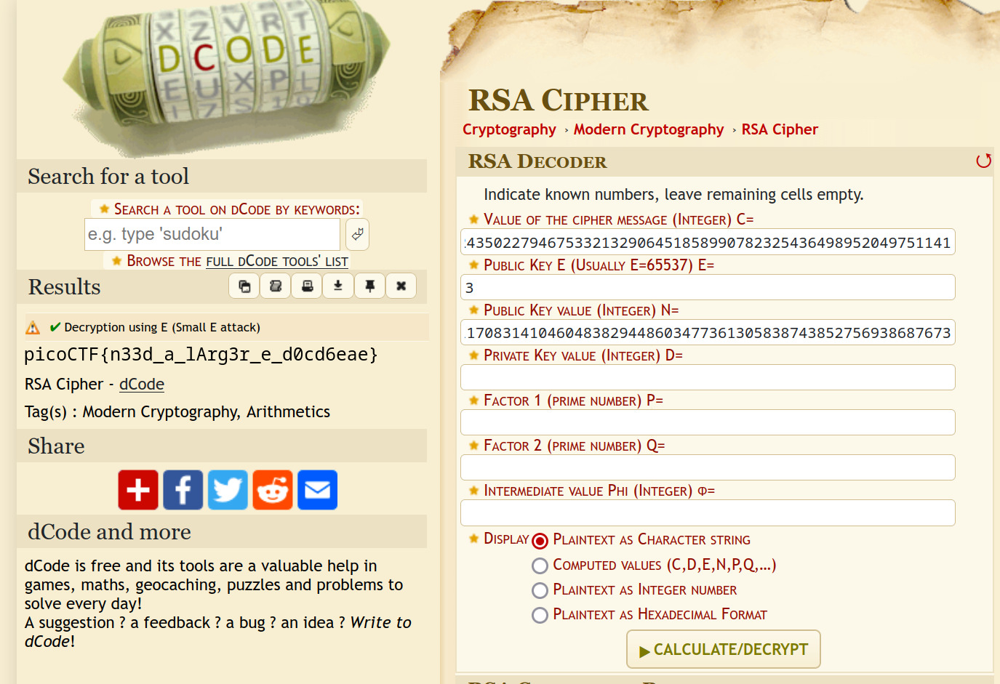

# New Caesar

**Flag:** `picoCTF{et_tu?_07d5c0892c1438d2b32600e83dc2b0e5}`

In this, we're given an encrypted mesage `dcebcmebecamcmanaedbacdaanafagapdaaoabaaafdbapdpaaapadanandcafaadbdaapdpandcac` and a file `new_caesar.py`. The file's contents are

```py
import string

LOWERCASE_OFFSET = ord("a")
ALPHABET = string.ascii_lowercase[:16]

def b16_encode(plain):
    enc = ""
    for c in plain:
        binary = "{0:08b}".format(ord(c))
        enc += ALPHABET[int(binary[:4], 2)]
        enc += ALPHABET[int(binary[4:], 2)]
    return enc

def shift(c, k):
    t1 = ord(c) - LOWERCASE_OFFSET
    t2 = ord(k) - LOWERCASE_OFFSET
    return ALPHABET[(t1 + t2) % len(ALPHABET)]

flag = "redacted"
key = "redacted"
assert all([k in ALPHABET for k in key])
assert len(key) == 1

b16 = b16_encode(flag)
enc = ""
for i, c in enumerate(b16):
    enc += shift(c, key[i % len(key)])
print(enc)
```

It looks like the encryption algorithm follows two steps:

1. The flag is converted into base16 using the function `b16_encode`.
2. The flag is then shifted by changing it to the value in `ALPHABET` of the index calculated by adding the alphabetical positions of the one-character key and flag, dividing it by the length of `ALPHABET` (i.e. 16), and finding its remainder.

To decrypt the message, we follow the reverse of the above steps

```py
import string

LOWERCASE_OFFSET = ord("a")
ALPHABET = string.ascii_lowercase[:16]

def unshift(c, k):
    t1 = ord(c) - LOWERCASE_OFFSET
    t2 = ord(k) - LOWERCASE_OFFSET
    return ALPHABET[(t1 - t2) % 16]

def decode(enc):
    dec = ""
    for i in range(0, len(enc), 2):
        binary = "{0:04b}{1:04b}".format(ALPHABET.index(enc[i]), ALPHABET.index(enc[i+1]))
        dec += chr(int(binary, 2))
    return dec

flag = "dcebcmebecamcmanaedbacdaanafagapdaaoabaaafdbapdpaaapadanandcafaadbdaapdpandcac"

for key in ALPHABET:
    b16 = ""
    for c in flag:
        b16 += unshift(c, key)
    print(decode(b16))
```

Here, we first run a for loop for every possible key from 'a' to 'p'.

Next, we unshift the characters using the `unshift` function. In it, we do the reverse of what the `shift` function did— subtracting the position of the key from each character, modding it with the length of the alphabet (16), and finally returning the value stored at its index in `ALPHABET`.

Finally, we decode the unshifted key (`b16`). This occurs by taking each pair of characters, finding their indices within `ALPHABET`, converting them to binary and then ASCII.

Running the code, we get the following results

```
~/Downloads $ python3 decode.py
2A,AB
210? ,
!01ûó ñ/üôõþ/ýðÿô þ.ÿþòüü!ôÿ /þ.ü!ñ
/
/ ê
ëâàëãäíìïîãíîíáëëãîíëà
ÛÞÝÒÜß
Ü    ÝÜÐÚÚÒÝ
 Úß
ÈèÉÀýÎüÉÁÂËüÊÍÌÁýËûÌËÏÉÉþÁÌýüËûÉþÎ
íü×üý·×¸¿ì½ë¸°±ºë¹¼»°ìºê»º¾¸¸í°»ìëºê¸í½
ÜëÆëì¦Æ§®Û¬Ú§¯ ©Ú¨«ª¯Û©Ùª©­§§Ü¯ªÛک٧ܬ
ËÚµÚÛµÊÉÉÊÈËÊÉÈË
ºÉ¤Éʤ¹¸¸¹·º¹¸·º
©¸¸¹st{¨y§t|}v§uxw|¨v¦wvztt©|w¨§v¦t©y
§§¨bcjhckledgfkefeicckfech
qQqRYWRZ[TSVUZTUTXRRZUTRW
v`@`AHuFtAIJCtBEDIuCsDCGAAvIDutCsAvF
et_tu?_07d5c0892c1438d2b32600e83dc2b0e5
TcNcd.N/&S$R/'(!R #"'S!Q"!%//T'"SR!Q/T$
CR=RS=BAAB@CBA@C
```

The only decoding with real words seems to be `et_tu?_07d5c0892c1438d2b32600e83dc2b0e5`. We check it by wrapping it with `picoCTF{}`, and it turns out to be correct.

# miniRSA

**Flag:** `picoCTF{n33d_a_lArg3r_e_d0cd6eae}`

Here, we get a file `ciphertext` with the following contents

```
N: 29331922499794985782735976045591164936683059380558950386560160105740343201513369939006307531165922708949619162698623675349030430859547825708994708321803705309459438099340427770580064400911431856656901982789948285309956111848686906152664473350940486507451771223435835260168971210087470894448460745593956840586530527915802541450092946574694809584880896601317519794442862977471129319781313161842056501715040555964011899589002863730868679527184420789010551475067862907739054966183120621407246398518098981106431219207697870293412176440482900183550467375190239898455201170831410460483829448603477361305838743852756938687673
e: 3

ciphertext (c): 2205316413931134031074603746928247799030155221252519872650080519263755075355825243327515211479747536697517688468095325517209911688684309894900992899707504087647575997847717180766377832435022794675332132906451858990782325436498952049751141
```

It looks like a simple RSA encrypted cipher text. Notice the small value of `e` (3). It ideally should be something much larger like 65537, or else the cipher can be easily brute-forced. We do exactly that, using the [dcode RSA decryptor](https://www.dcode.fr/rsa-cipher)



# basic-mod1

**Flag:** `picoCTF{R0UND_N_R0UND_ADD17EC2}`

In this challenge, a message is to be decrypted in the following fashion:

1. Each number is converted to its remainder after division by 37, i.e. *mod 37*
2. The subsequent remainders are then used as indices in the following manner:
    - Digits 0 to 25 are mapped as the uppercase alphabet.
    - Digits 26 to 35 are mapped as the ten digits.
    - 36 is an underscore (`_`).

The python code for the decoding using this algorithm is this

```py
import string

message = [350, 63, 353, 198, 114, 369, 346, 184, 202, 322, 94, 235, 114, 110, 185, 188, 225, 212, 366, 374, 261, 213]
keys = [i for i in string.ascii_uppercase + string.digits + '_']

for char in message:
    print(keys[char % 37])

```

Executing it, we get the following output

```
~/Downloads $ python3 main.py | tr -d '\n'
R0UND_N_R0UND_ADD17EC2
~/Downloads $
```

So the flag becomes `picoCTF{R0UND_N_R0UND_ADD17EC2}`.
