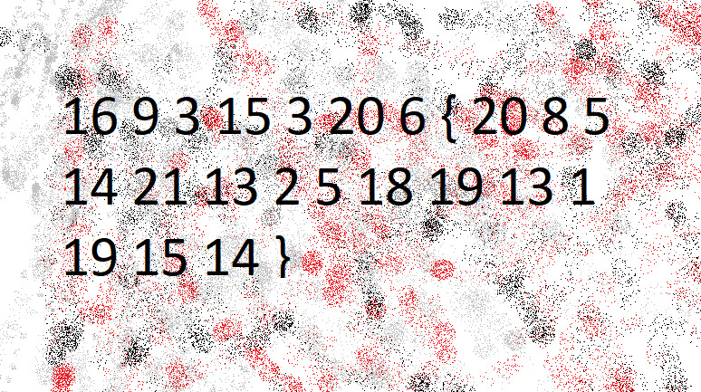
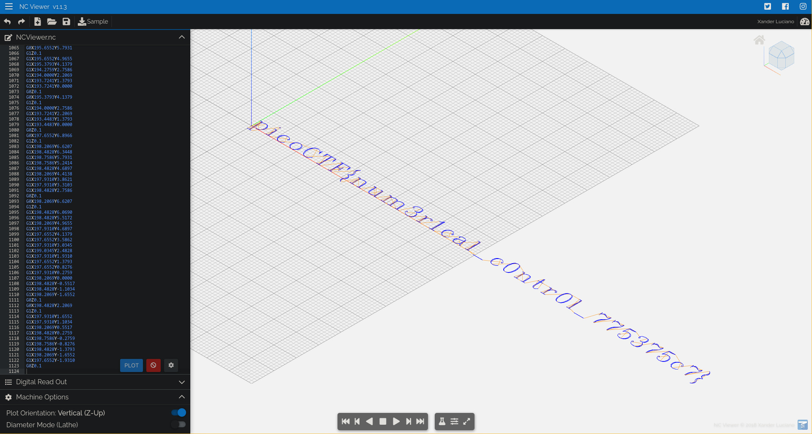

# Domain: Cryptography

## Mod 26

**Flag:** `picoCTF{next_time_I'll_try_2_rounds_of_rot13_ulYvpVag}`

We are given the flag as `cvpbPGS{arkg_gvzr_V'yy_gel_2_ebhaqf_bs_ebg13_hyLicInt}`. This is a simple `ROT-13` cipher, a special case of the Caesar cipher in which the letters are shifted by 13 positions.
Putting this into any online `ROT-13` decoder (I used *https://rot13.com/*), we get `picoCTF{next_time_I'll_try_2_rounds_of_rot13_ulYvpVag}`.

## The Numbers

**Flag:** `PICOCTF{THENUMBERSMASON}`

We're given an image with a list of numbers along with opening and closing brackets.



It seems to be the flag with the letters encoded as their positions in the alphabet. We write some simple C code to decode it

```c
#include <stdio.h>

int main()
{
    int numbers[] = {
        16, 9, 3, 15, 3,  20, 6, // The part before the brackets
        20, 8, 5, 14, 21, 13, 2, 5, 18, 19, 13, 1, 19, 15, 14 // The part after the brackets
    };

    for (int i = 0; i < 22; i++) {
        printf("%c", numbers[i] + 65);
    }

    return 0;
}
```

Compiling and running it, we get
```
~/Projects $ gcc main.c -o main && ./main
QJDPDUGUIFOVNCFSTNBTPO
```

This seems to be a Caesar cipher. Using the solver on [dcode](https://www.dcode.fr/caesar-cipher) and decrypting it using brute-force, we get the answer as `PICOCTFTHENUMBERSMASON`.

# Domain: Reverse Engineering

## speeds and feeds

**Flag:** `picoCTF{num3r1cal_c0ntr0l_775375c7}`

Running the given netcat command, we get a strange sequence of characters

```
~ $ nc mercury.picoctf.net 53740
G17 G21 G40 G90 G64 P0.003 F50
G0Z0.1
G0Z0.1
G0X0.8276Y3.8621
G1Z0.1
G1X0.8276Y-1.9310
G0Z0.1
G0X1.1034Y3.8621
.
.
.
```

These, as it turns out, are G-code instructions. G-code is a programming language specially designed for the control of CNC machines and 3D printers. Using an online G-code interpreter such as [NCViewer](https://ncviewer.com/), we get the following image.



Thus, the code turns out to be `picoCTF{num3r1cal_c0ntr0l_775375c7}`.

## crackme-py

**Flag:** `picoCTF{1|\/|_4_p34|\|ut_f3bc410e}`

We're given a file `crackme.py`. In it we find the following variable declaration

```py
bezos_cc_secret = "A:4@r%uL`M-^M0c0AbcM-MFE07b34c`_6N"
```

We're also given two functions, `decode_secret` and `choose_greatest`

```py
def decode_secret(secret):
    """ROT47 decode

    NOTE: encode and decode are the same operation in the ROT cipher family.
    """

    # Encryption key
    rotate_const = 47

    # Storage for decoded secret
    decoded = ""

    # decode loop
    for c in secret:
        index = alphabet.find(c)
        original_index = (index + rotate_const) % len(alphabet)
        decoded = decoded + alphabet[original_index]

    print(decoded)


def choose_greatest():
    """Echo the largest of the two numbers given by the user to the program

    Warning: this function was written quickly and needs proper error handling
    """

    user_value_1 = input("What's your first number? ")
    user_value_2 = input("What's your second number? ")
    greatest_value = user_value_1 # need a value to return if 1 & 2 are equal

    if user_value_1 > user_value_2:
        greatest_value = user_value_1
    elif user_value_1 < user_value_2:
        greatest_value = user_value_2

    print( "The number with largest positive magnitude is "
        + str(greatest_value) )
```

And at the very end of the file, the latter function runs

```py
choose_greatest()
```

We change the function to `decode_secret` and set its parameters as `bezos_cc_secret`. Executing the python script now, we get the flag.

```py
decode_secret(bezos_cc_secret)
```

```
~/Downloads $ python3 crackme.py
picoCTF{1|\/|_4_p34|\|ut_f3bc410e}
```

