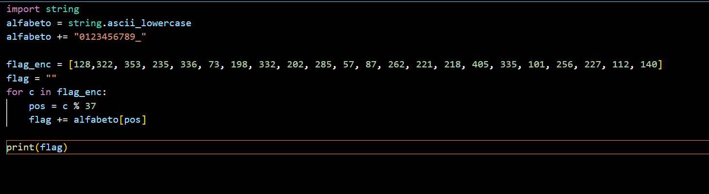

<b>
PicoCTF - basic-mod1 Writeup 
</b>

 

<b>Introduction: </b>
This writeup provides a step-by-step guide for solving the "basic-mod1" challenge in PicoCTF. We were given a weird message being passed around on the servers, and the challenge hints at having a working decryption scheme. The task is to download the provided message and apply the decryption scheme, which involves taking each number mod 37 and mapping it to a character set.

<b>Author:</b> Misha Jain

<b>Date:</b> November 15, 2023

<b>Tools Used:</b> 
- Text Editor

<b>Challenge Description:</b> 
The challenge provides a message that needs to be decrypted using a specific scheme. Each number in the message should be taken modulo 37 and mapped to a character set, where 0-25 corresponds to the alphabet (uppercase), 26-35 corresponds to decimal digits, and 36 corresponds to an underscore.

<b>Exploitation:</b> 
This can be solved using the following python code. The flag is picoCTF{r0und_n_r0und_79c18fb3}.

<b>Conclusion:</b> 
The Basic Mod-1 challenge provides an opportunity to apply modular arithmetic to decrypt a message. It reinforces the concept of mapping numbers to a character set.

