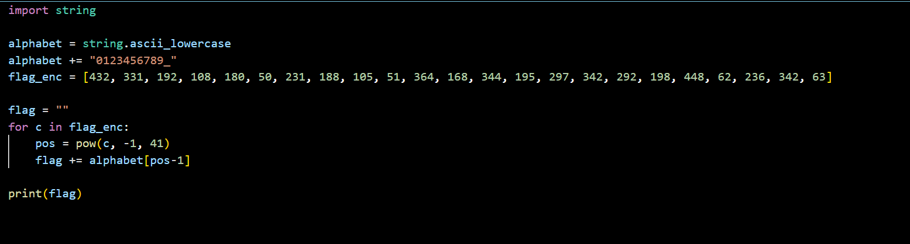

<b>
PicoCTF - basic-mod2 Writeup 
</b>

 

<b>Introduction: </b>
This writeup provides a step-by-step guide for solving the "basic-mod2" challenge in PicoCTF. In the Basic Mod-2 challenge, we are given a message to decrypt. The decryption involves taking each number, finding its modular inverse modulo 41, and then mapping it to a character set. The character set consists of 1-26 representing the alphabet, 27-36 representing decimal digits, and 37 representing an underscore.

<b>Author:</b> Misha Jain

<b>Date:</b> November 15, 2023

<b>Tools Used:</b> 
- Text Editor

<b>Challenge Description:</b> 
The challenge provides a message that needs to be decrypted using a specific scheme. Each number in the message should be taken modulo 41, its modular inverse should be found, and then it should be mapped to the specified character set.

<b>Exploitation:</b> 
This can be solved using the following python code. The flag is picoCTF{1nv3r53ly_h4rd_c680bdc1}.

<b>Conclusion:</b> 
The Basic Mod-2 challenge provides an opportunity to apply modular arithmetic and modular inverses to decrypt a message. It reinforces the concept of finding inverses in a modular context.

