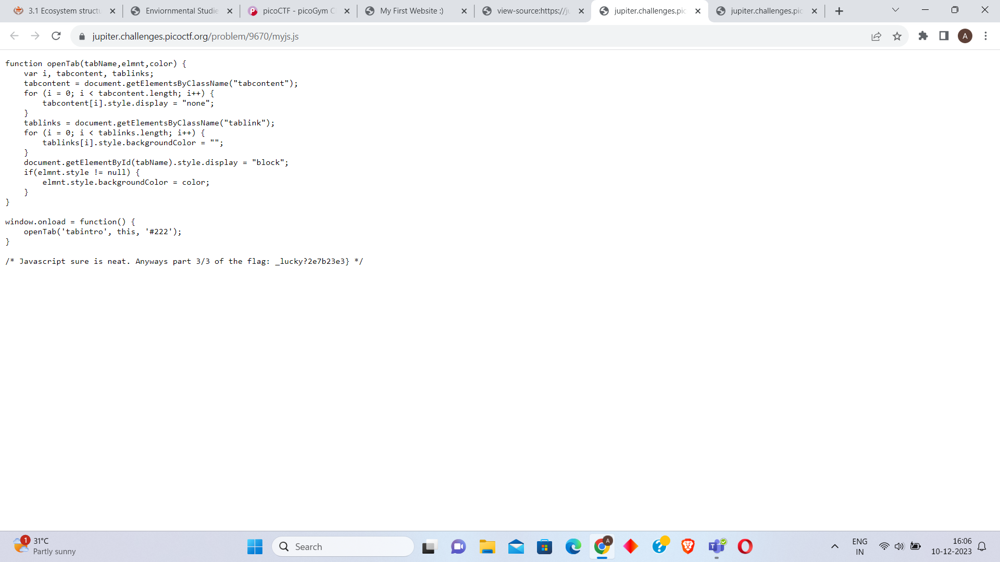

Here we visit the website and see:-

Then we go the the source code to see this

In this Image we have 1st part of the flag
Then we check the css code to get the 2nd part of the flag

In the js code we find the 3rd and last part of the flag

The flag is picoCTF{tru3_d3t3ct1ve_0r_ju5t_lucky?2e7b23e3}