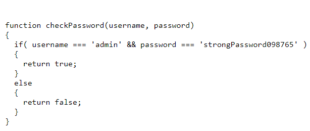

# Local Authority
Here we start with going to a website where we are asked for username and password which are not known to us.
Note: Use `Ctrl` + `U` to open source code.
The website looks like this:-

The source code looks like this:-

Here we can see that the it redirects us to `login.php`
The code here is:-

 

Now there is a file `secure.jss` which contains the correct username and pswd

Upon Entering the correct details we get the ctf.
`picoCTF{j5_15_7r4n5p4r3n7_05df90c8}`