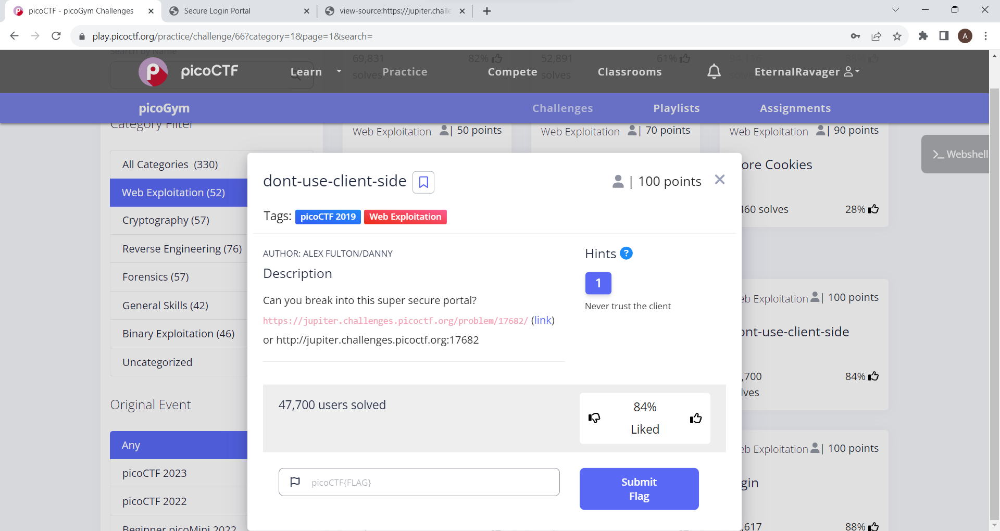
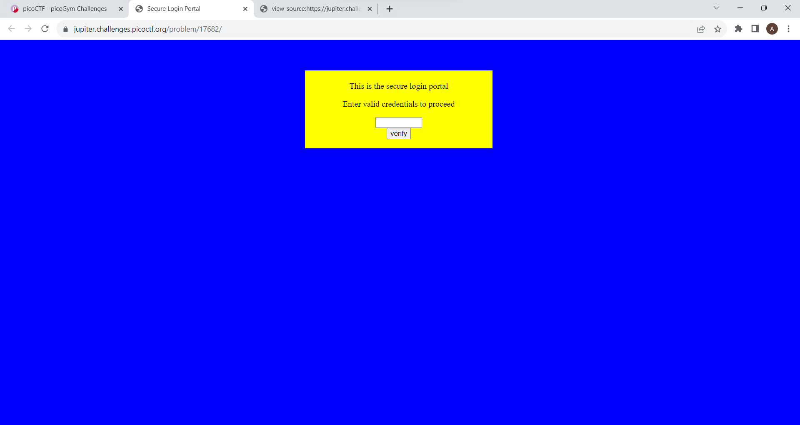
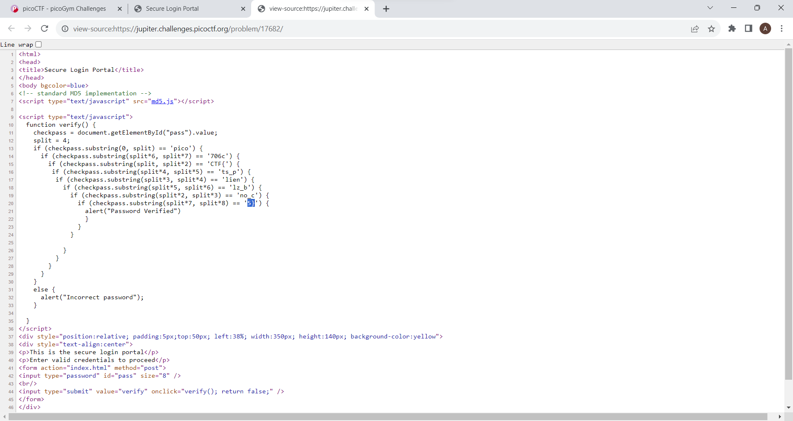
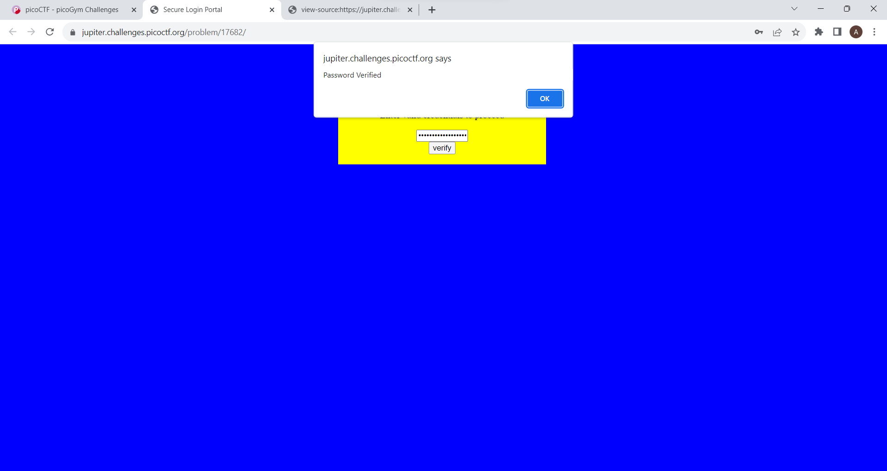

This is the challenge:-

This is the webpage:-

After gettting to the source code we see that the correct password has been jumbled and is to be checked by some method
Thus I got the flag by adding the parts of password

The password is correct

The flag is picoCTF{no_clients_plz_b706c5}