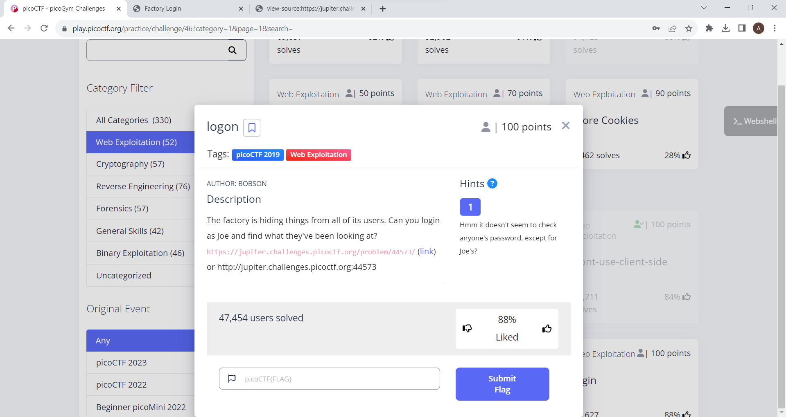
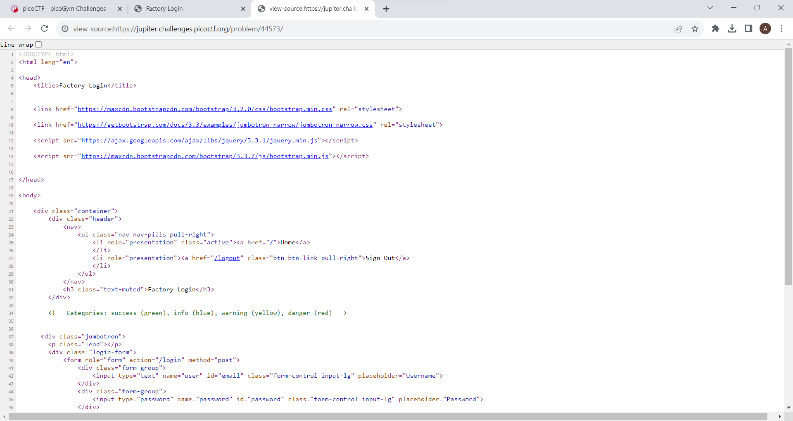
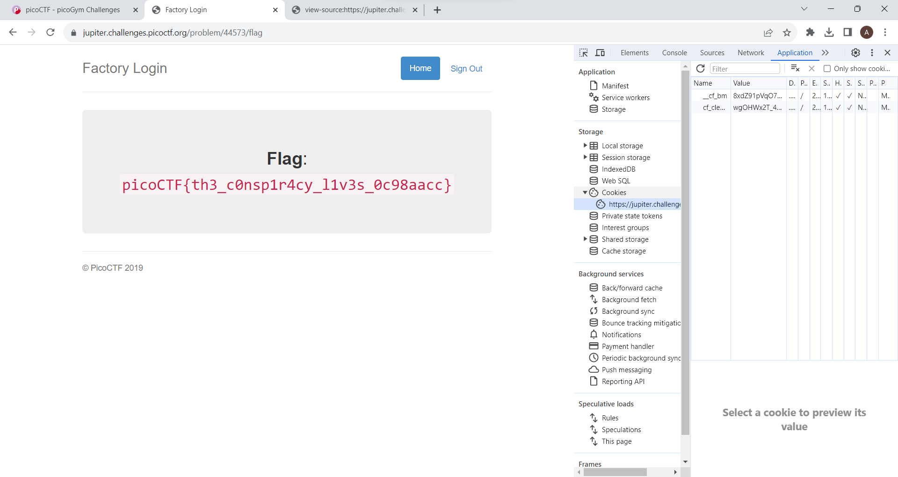

This is the challenge 

After getting to the webiste I tried logging in but coudn't get the flag and nothing could be found from the source code.

So I searched online and learned that it's because of the cookie.
I learned that that a cookie might be used to store a separate variable that might be preventing us from seeing the flag. So I saw an admin cookie set to False. Changing this to True and refreshing the page gives us the flag:

picoCTF{th3_c0nsp1r4cy_l1v3s_0c98aacc}