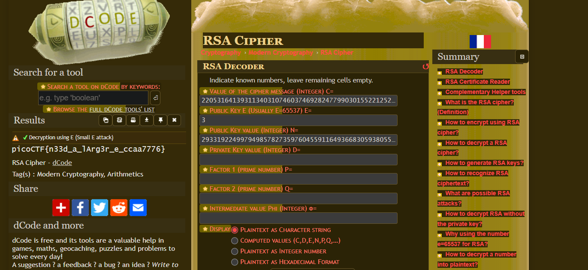

# miniRSA Encryption Challenge Writeup

## My Encounter with RSA

Facing the RSA encryption challenge, I embarked on understanding the intricacies of RSA encryption and decryption. However, despite my efforts, the complexities of the algorithm left me perplexed and unable to decipher the encrypted message.

## Decrypting with External Tools

In my quest for a solution, I turned to external resources and utilized dcode.org's RSA cipher decryptor. This tool proved instrumental in decrypting the encrypted message, providing me with the solution to the challenge.

