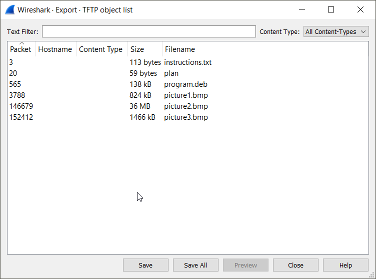
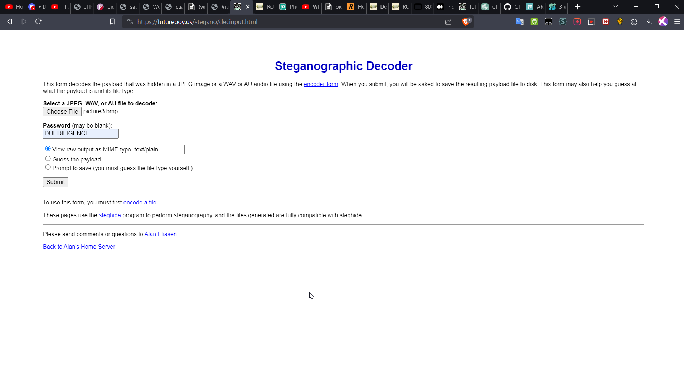

# TFTP Steganography Challenge Writeup

## My Exploration

I began by examining the contents of the `tftp.pcapng` file in Wireshark, which revealed ongoing file transfers. After exporting six files, my attention was drawn to the instruction file. Utilizing a cipher identifier, I identified ROT-13 encryption in the text, and it conveyed that TFTP traffic wasn't encrypted. The challenge was to disguise the flag transfer.

## Unveiling the Plan

Further investigation led me to the plan file, also encrypted using ROT-13 'I USED THE PROGRAM AND HID IT WITH - DUEDILIGENCE. CHECK OUT THE PHOTOS'. Installing the provided program (`.deb` file) initiated the installation of steghide. Recognizing steganography as a potential technique, I proceeded with my exploration.

## The Extraction Process

With the program installed, I attempted steganography extraction using an online tool. The key "DUEDILIGENCE" was utilized in the extraction process on three photos. The significant revelation occurred in `picture3.bmp`.

## Flag Uncovered

Hidden within `picture3.bmp`, the flag was unveiled:

`picoCTF{h1dd3n_1n_pLa1n_51GHT_18375919}`

