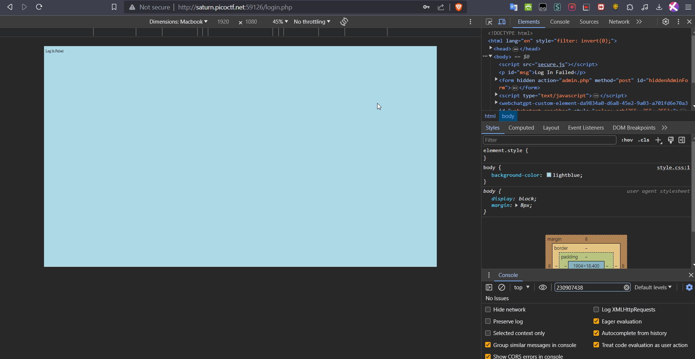
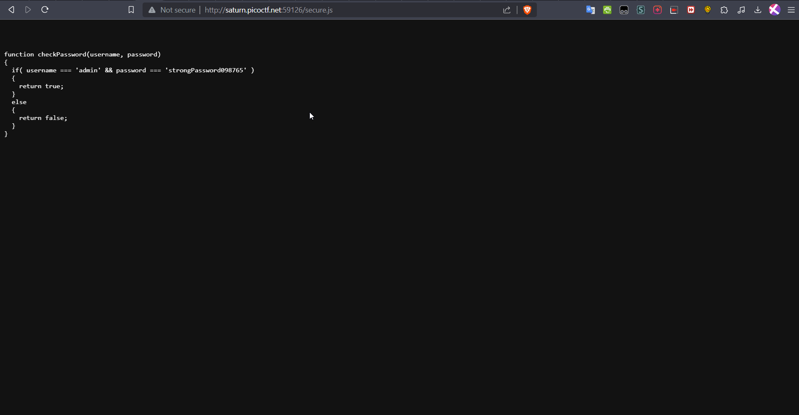

# Local Authority

## My Approach

I started the challenge by visiting the website [http://saturn.picoctf.net:59126/](http://saturn.picoctf.net:59126/) and attempted to log in with random username and password combinations. The unsuccessful attempts led me to [http://saturn.picoctf.net:59126/login.php](http://saturn.picoctf.net:59126/login.php).

Intrigued by the redirection, I decided to inspect the source code of the login page. In the browser's developer tools, I noticed that the website utilized a JavaScript file named `secure.js`. I then accessed [http://saturn.picoctf.net:59126/secure.js](http://saturn.picoctf.net:59126/secure.js) to examine its contents.

## Discovery

To my surprise, the contents of `secure.js` revealed plaintext usernames and passwords embedded in the JavaScript code.

